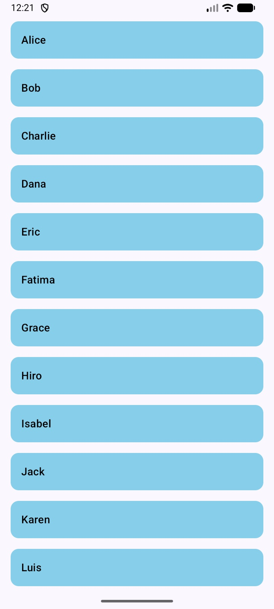
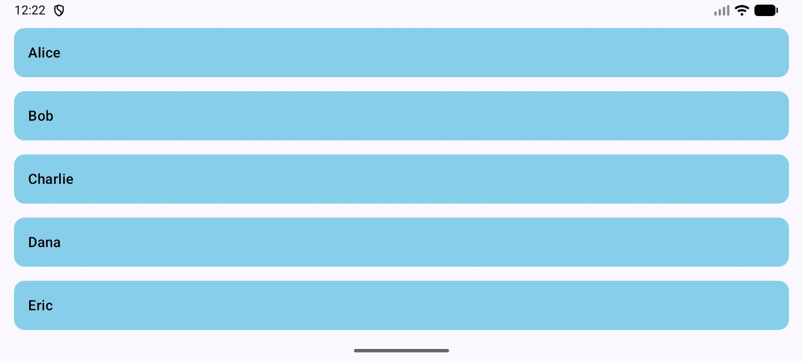

# README

## Student Information
- Name: Ashish Joshi
- Assignment: Midterm Exam (Q3 - Lazy Lists)

---

## Overview
This task creates a scrollable list of student names using Jetpack Compose. The screen displays 20 student names in a `LazyColumn`, with each name shown inside a `Card`.

---

## Features
- Displays a list of 20 student names
- Uses `LazyColumn` for efficient lazy list rendering
- Uses the `items()` DSL to display the list data
- Shows each student name inside a `Card`
- The list is scrollable
- Works in both portrait and landscape orientations

---

## Approach

### 1. Student Data
A list of 20 student names is created inside `StudentListScreen()`:

- Alice
- Bob
- Charlie
- Dana
- Eric
- Fatima
- Grace
- Hiro
- Isabel
- Jack
- Karen
- Luis
- Maya
- Nate
- Olivia
- Priya
- Quinn
- Ravi
- Sara
- Tom

### 2. LazyColumn
The screen uses `LazyColumn` to display the list.  
This allows only the visible items to be composed as needed, which is the intended approach for scrollable lists in Jetpack Compose.

### 3. items() DSL
The `items(students)` block is used to iterate through the list and create one UI item for each student name.

### 4. StudentItem Composable
Each name is displayed inside a `Card` using a separate `StudentItem()` composable.  
This keeps the code modular and easier to read.

---

## Requirement Checklist
This solution satisfies all question requirements:

- Uses `LazyColumn` 
- Uses `items()` DSL 
- Displays 20 student names 
- Displays each name inside a `Card` 
- List is scrollable 

---

## Files / Structure
- `StudentListScreen`  
  Creates the list of students and displays them in a `LazyColumn`

- `StudentItem`  
  Displays each student name inside a styled `Card`

- `MainActivity`  
  Sets the screen content using Compose

---

## Screenshots

### Portrait Mode

### Landscape Mode

---

## Testing
- Verified that all 20 student names are included
- Verified that the list scrolls vertically
- Verified that each item is displayed inside a `Card`
- Verified that `LazyColumn` and `items()` are used as required
- Verified the UI in both portrait and landscape orientations

---

## Assumptions
- No click behavior was required for list items
- Only displaying the names in a scrollable list was required
- Basic card styling was added for readability and presentation

---

## AI Usage Disclosure
ChatGPT was used to:
- Help solve minor errors
- Assist with formatting and structuring the README
- Review the solution against the question requirements

All implementation, logic, and final code were written and understood by me.

---

## Final Note
This solution focuses on correctly using `LazyColumn` and the `items()` DSL to build an efficient, scrollable list of student names in Jetpack Compose.
